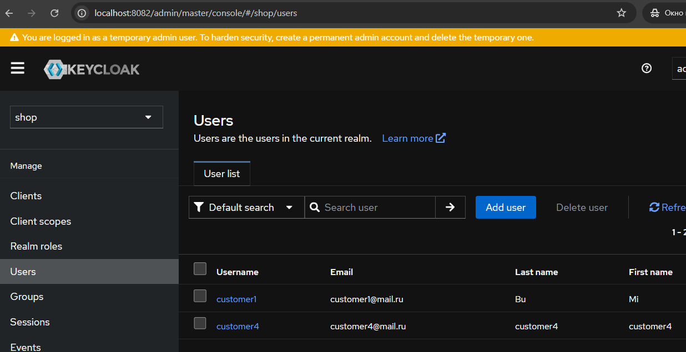
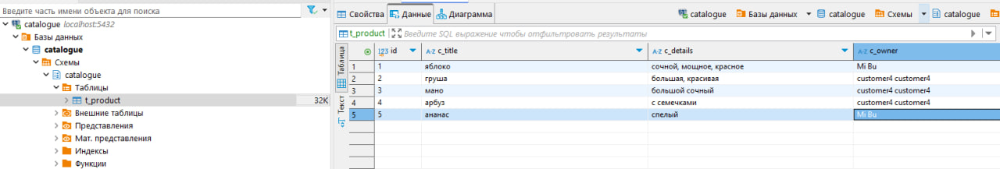
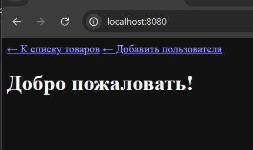

# Разработка проектов со Spring (2024)

## Keycloak

Запуск в Docker:
1) запустить в терминале docker compose up -d 
поднимаются все контейнере
2) запустить 2 приложения (клиента, и бек-сервис) в конфигурации standalone
3) создать 2 юзера на странице 8080 (добавить пользователя)
4) на странице 8082 в кейклок выдать им права менеджеров (ROLE_MANAGER)
5) желательно под каждым пользователем заходить в инкогнито, чтоб считывался bearer для каждого пользователя отдельно и не нужно было его очищать.

результат программы можно зайти под авторизованным пользователем с определенной ролью и посмотреть товары, которые он добавил себе на страницу.

может возникнуть проблема при скачивании проекта, что не читается миграция, нужно посмотреть в логах. 
как решение можно стереть папку и еще раз ее отдельно прокинуть (db) (migration) и добавить файл.